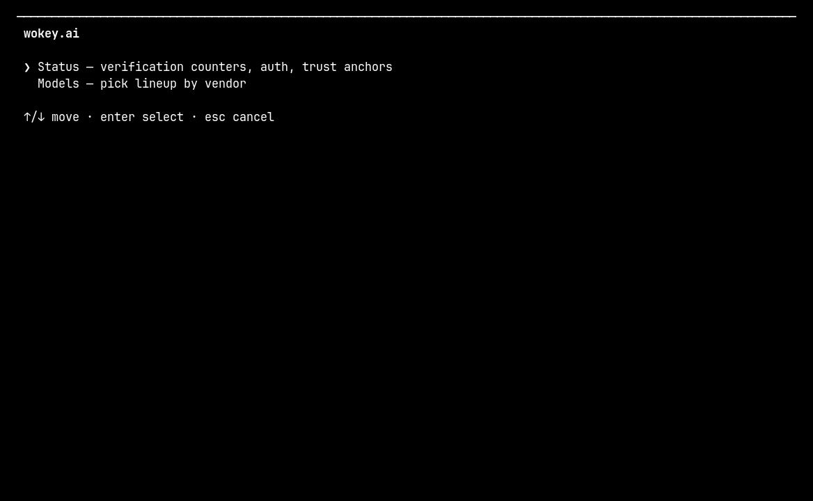

# pi-wokey

**Use [wokey.ai](https://wokey.ai)'s GPT and Claude models without having to take them on faith.**

Every relay that sits between you and a model is a middleman. This extension is a 
[pi](https://pi.dev) provider that cryptographically checks every single response
against wokey's TEE attestation, then tells you plainly — in one word — whether that
response can be proven.

- You keep using the model exactly as you normally would.
- Verification runs **silently in the background on every request**.
- It costs **about a millisecond** of local CPU, no extra network round-trip, and
  nothing added to your bill.
- If a response can't be proven, you find out. Nothing is silently swallowed.

> **Cost in one line:** ~1 ms per response, versus seconds of model latency.
> Measured with Node 24 on the primitives involved: P-384 certificate check 0.55 ms,
> Ed25519 statement check 0.09 ms, SHA-256 body hashing 0.02 ms. It is pure local
> arithmetic — your request is sent once, exactly as before, and the check happens
> while the reply streams back.

---

## Contents

- [Install](#install)
- [Usage](#usage)
- [What you get](#what-you-get)
- [Reading the verdict](#reading-the-verdict)
- [Models](#models)
- [How the verification works](#how-the-verification-works)
- [What "verified" does and doesn't mean](#what-verified-does-and-doesnt-mean)
- [Trust anchors](#trust-anchors)
- [Configuration](#configuration)
- [Troubleshooting](#troubleshooting)
- [Vendored code](#vendored-code)
- [Scope and contributions](#scope-and-contributions)
- [License](#license)

---

## Install

```bash
pi install npm:pi-wokey
```

That is the whole installation. Restart pi, or start a new session, and the `wokey`
provider is available with the models listed below.

## Usage

There is nothing to do. Pick `wokey` as your provider, choose a model, and work.

When you want to look under the hood, type `/wokey`. It opens a menu — arrow keys to
move, enter to pick, esc to cancel — and it loops, so you can do several things in one
visit:



*The `/wokey` panels — a verified exchange, folded and unfolded with `m`, then a failed
one (warn-only). Illustrative data.*

| Menu item | What it shows you |
|---|---|
| **Status** | How much balance you have left, the verdict counters, the last exchange with every individual check and its signed upstream tuple, and any catalog warnings from the last refresh. Press `m` to fold out the trust details — the pinned image measurement, the expected upstream per route, and the probing and settings state. Press `r` to refresh. |
| **Models** | The lineup with model family, API route, current rates, context window, and the exact thinking levels each model supports. |
| **Credentials** | Managed by pi — `/login wokey` (or `WOKEY_API_KEY`). This extension never reads or writes keys. |
| **Remove credentials** | `/logout wokey`. The old `/wokey unset` command only prints this guidance. |

In a headless run (`pi -p`, or no UI) the subcommands print instead of opening a panel:

```bash
/wokey status          /wokey models
```

Give pi your wokey key with `/login wokey`, or export `WOKEY_API_KEY` — those are the
only credential configuration this extension uses. See [Configuration](#configuration)
for what else you can change.

Upgrading from an older version? If your `~/.pi/agent/wokey.json` still holds an `apiKey`
or old route/trust keys (`baseUrl`, `api`, `expectedHost(s)`, `expectedPaths`,
`codexEnvelope`), delete the file (or at least those entries) and re-enter the key with
`/login wokey`. The old `/wokey key` and `/wokey unset` commands now only print this
guidance — they never read or write credentials. `/wokey status` warns you while a
legacy key is still sitting in that file.

## What you get

| | |
|---|---|
| **Four models, two native routes** | `gpt-6.1-sol`, `gpt-6-luna`, `gpt-6-astra` through pi's OpenAI Responses adapter plus `claude-opus-5-5` through pi's native Anthropic Messages adapter, each with wokey's live context limits and thinking levels. |
| **Verified every response** | Each reply carries a signed proof from the enclave that produced it. This extension checks it and labels the exchange. |
| **Warn-only, never blocking** | A failed or missing proof is reported, but your reply is always delivered. A relay outage degrades into a notice, not a dead session. |
| **Silent by default** | No popups, no prompts, no flags to set. `/wokey status` is there when you want the detail. |
| **Live catalog sync** | Context windows and rates are re-read from wokey on every startup, so the numbers you see are current. |
| **Balance at a glance** | `/wokey` reads what you have left to spend from wokey when you open it, so you never have to leave the terminal to check. |
| **Native TUI panels** | `/wokey` renders as real pi panels, not a wall of text. |

## Reading the verdict

Every exchange gets exactly one of four labels.

| Verdict | What it means |
|---|---|
| ✅ `verified` | Every check passed. |
| 🟡 `verified-with-gaps` | Everything achievable passed, but one structural check is unavailable (currently request binding — see [below](#known-gaps-deliberately-not-hidden)). Shown in `/wokey`, not warned on every turn. |
| ❌ `failed` | Attestation, signature, hashes, or the upstream host/path did not match. Treat the response as untrusted. |
| ⚠️ `unproven` | No proof record was present, so there was nothing to verify. |

`/wokey` shows the running counters, your remaining balance, and the full check list for
the last exchange. Anything that is not `verified` is also mirrored to stderr, so you see it
even in a headless run:

```
[wokey] ❌ wokey verification failed — Response signature: received bytes do not match the signed hash — response was modified
[wokey] ⚠️ wokey response is not attested — Proof present: no tee.proof in the response — nothing was attested
```

## Models

Two routes, one provider. GPT models go through pi's OpenAI Responses adapter against
the OpenAI-compatible relay root `https://api.wokey.ai/v1`; Claude Opus 5.5 goes through
pi's native Anthropic Messages adapter against `https://api.wokey.ai`. The route is
pinned per model — no setting can move a model to another adapter.

| Model | Family | Thinking levels |
|---|---|---|
| `gpt-6.1-sol` | GPT | low, medium, high, xhigh, max |
| `gpt-6-luna` | GPT | off, low, medium, high, xhigh, max |
| `gpt-6-astra` | GPT | low, medium, high, xhigh, max |
| `claude-opus-5-5` | Claude | low, medium, high, xhigh, max |

`gpt-6.1-sol` and `gpt-6-astra` cannot disable reasoning — asking for `off` is clamped
up to `low`. Only `gpt-6-luna` supports turning it off. These levels come from OpenAI's
model cards rather than from probing the relay, because the gateway happily accepts
efforts the models themselves do not support.

**Prices change, so this README does not list them.** wokey uses dynamic pricing with
peak and off-peak rates. Context limits and rates are re-read from wokey on every
startup; the current numbers for your lineup are in `/wokey` → **Models**, and on
wokey's site at <https://wokey.ai/models>.

## How the verification works

No background service, no extra API call, no telemetry. Alongside the model output,
wokey returns a **Proof-of-Observation**: a statement signed by the enclave that handled
your request, plus the attestation document that proves what that enclave is.

- wokey runs the upstream call inside an **AWS Nitro enclave** and returns the proof as
  a trailing `event: tee.proof` record on the response stream.
- The proof binds, by hash, **the exact request body and response body**, the upstream
  host and path, the HTTP method, status and content-type, and a nonce.
- The signing key is vouched for by a **COSE/P-384 attestation document** that chains to
  the AWS Nitro root certificate and reports the enclave's image measurement (PCR0).

The extension captures the raw bytes as they stream past (pi's normal hooks cannot see
them), verifies the statement, removes the proof record before pi's adapter sees it, and
records the verdict. On every response it checks:

```
attestation chains to the pinned AWS Nitro root · certificate validity ·
enclave image measurement (PCR0) equals your pinned value · signing key is the
attested key · nonce binding · Ed25519 statement over host/path/method/status/
content-type · response body hash · request body hash · upstream host · upstream path
```

All of that is hashing and signature verification — the reason it costs about a
millisecond rather than a round-trip.

## What "verified" does and doesn't mean

### What a green report establishes

An enclave running the image whose measurement equals your pinned `PCR0` opened a real
TLS connection to a party holding a valid certificate for the route's signed upstream
(`chatgpt.com` for GPT, `api.anthropic.com` for Claude), fetched exactly the bytes you
received, and signed that fact. Nothing in between could have altered them.

### What it does not establish

That the upstream provider's own API served the model. The signed upstream is a TLS
endpoint observed by the enclave — (`chatgpt.com`, `/backend-api/codex/responses`) for
GPT, (`api.anthropic.com`, `/v1/messages`) for Claude — not necessarily the provider's
canonical API host. Neither OpenAI nor Anthropic signs responses, so the strongest
available claim is "a valid certificate for that host was observed". This ceiling is
structural, not a gap in the implementation.

### Known gaps, deliberately not hidden

- **Request binding is unavailable.** wokey rewrites the request body before the enclave
  sees it, and no client-side serialization reproduces that rewrite, so the signed
  request hash commits to wokey's body rather than yours. This is reported as a gap,
  not a failure. Prompt integrity is still covered indirectly: changing the prompt
  changes the signed hash, and the served model is read from the signed response body.
- **Headers and query strings are unsigned.** Model and thinking level live in the
  request body and are bound, so a relay could still alter beta feature flags.
- **The nonce is relay-generated**, not a challenge you supply, so a genuine earlier
  exchange could in principle be replayed inside the certificate validity window.
- **Verification is per-exchange and local.** Only you, holding both byte strings, can
  check the content bindings.

## Trust anchors

Verification is only as strong as the values it is pinned to. There are three:

| Anchor | What it is | What you are trusting |
|---|---|---|
| **AWS Nitro root** | The hardware root the attestation chains to, pinned by fingerprint in the verifier. | Hardware. A compelled or broken Nitro service defeats it. |
| **Enclave image (PCR0)** | A hardcoded 96-hex-digit measurement of the audited enclave image. | **Operator-published.** Accepting the shipped value means trusting wokey's reproducible build. Replace it to remove that trust. |
| **Upstream identity** | The accepted signed host/path/method tuples, one per route: (`chatgpt.com`, `/backend-api/codex/responses`, `POST`) and (`api.anthropic.com`, `/v1/messages`, `POST`). | Measured from live proofs, not assumed. Any other route fails loudly. |

**Upgrading the PCR0 anchor.** The shipped `PUBLISHED_PCR0` comes from wokey's
reproducible-build document. To stop trusting the operator, build the enclave yourself
from the pinned revision and replace the constant in `config.ts`. Even without the full
build, pinning the value on day one and alerting on drift turns this into **change
detection** — which is the attack that actually matters: a quiet downgrade later rather
than a lie today.

The provider never reads a PCR0 out of the proof itself. An unset anchor is reported as
a **failure**, not a pass, because model substitution would otherwise go unchecked.

If wokey ever changes upstream, the host gate fails loudly. Widening it requires one
live proof from the new route — never pre-approve a host from documentation alone.

## Configuration

Credentials first: the only credential configuration is `/login wokey` (pi's own
credential store) or the `WOKEY_API_KEY` environment variable. This extension keeps no
key of its own.

Everything else is optional. Add keys to `~/.pi/agent/wokey.json` (defaults shown):

| Key | Default | Purpose |
|---|---|---|
| `expectedPcr0` | shipped constant | Your own pinned enclave measurement (96 hex digits). |
| `verify` | `true` | Turn proof probing off entirely. |
| `notifyOnFailure` | `true` | Surface failed and unproven verdicts. |

There are no adapter, base-URL, or trust-anchor settings: the route, API, relay root,
and signed upstream tuple are pinned per model in code, so a settings file cannot widen
what verification accepts. If your `wokey.json` still contains keys from an older
version (`apiKey`, `baseUrl`, `api`, `expectedHost(s)`, `expectedPaths`,
`codexEnvelope`), delete them — they are ignored, and a leftover `apiKey` is never used
as a credential. Re-enter the key with `/login wokey`.

Test-only environment overrides (unset in normal use): `WOKEY_EXPECTED_PCR0`,
`WOKEY_NO_VERIFY=1`.

## Troubleshooting

**Every response says `unproven`.** Nothing attested the response. Look at what the
relay is actually sending:

```bash
curl -sN https://api.wokey.ai/v1/responses \
  -H "authorization: Bearer $WOKEY_API_KEY" -H 'content-type: application/json' \
  -d '{"model":"gpt-6.1-sol","input":"hi","stream":true}' | tail -5
```

You should see a trailing `event: tee.proof`. If there is none, there is nothing to
verify.

**`402 insufficient_balance` everywhere.** Your key is fine — authentication passed.
The relay bills before it generates, so no response and no proof ever exist to check.

**The balance line shows `—`.** The balance could not be read: no key is set, the relay
did not answer in time, or the reply was not one. Everything else in the panel still
works, and `r` tries again.

**Old settings file after upgrading.** A `wokey.json` from before the native provider
keeps working for preferences, but its `apiKey` and route/trust keys are ignored — so
requests fail with "No API key found" even though the file holds a key. Delete the stale
entries (or the whole file) and re-enter the key with `/login wokey`. `/wokey status`
tells you while a legacy key is still present.

**Request binding is always a gap.** Expected. wokey rewrites the request body, so the
signed request hash cannot match a client-side value. Everything else still verifies.

**"No API key found" even though a key is set.** The key lives somewhere pi does not
read (for example a leftover `apiKey` in `wokey.json`). Run `/login wokey` or export
`WOKEY_API_KEY` and try again.

## Vendored code

`verify/signing.ts`, `verify/verify-attestation-cose.mjs` and `verify/tee-verify-core.ts`
are vendored verbatim from
[focuxdot/proof-of-observation](https://github.com/focuxdot/proof-of-observation) at
commit `4bb11f36370ca5d574310882e0e6aff30c424287`. Upstream is dual-licensed MIT +
Apache-2.0; this distribution exercises the Apache-2.0 option for those files and
retains their headers unedited. See `LICENSE` and `NOTICE` for terms and attribution.

## Scope and contributions

This project is a personal, independent integration built by one wokey subscriber. It
carries no affiliation with, endorsement from, or partnership with wokey.ai, and it uses
the wokey service strictly as an ordinary paying user.

The wokey platform fronts several upstream providers and offers a wider model catalog
than this extension currently covers. The integration is deliberately scoped to the four
models in daily personal use (three GPT, one Claude), so no other provider or model is
wired in on purpose.

That scope is a starting point rather than a ceiling. Contributions from other developers
that add further providers or models are welcome: please include tests for the new
coverage and open a pull request. Such changes will be reviewed and merged, so the
extension can serve a broader user base.

## License

Apache-2.0. See `LICENSE` and `NOTICE`.
